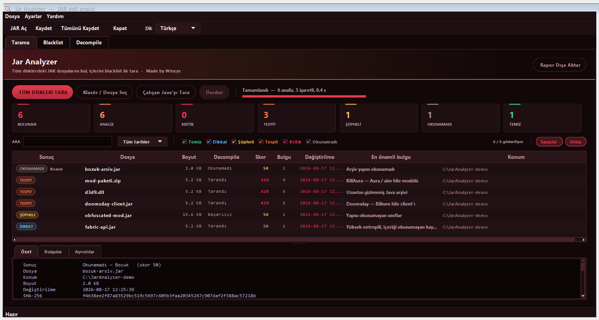
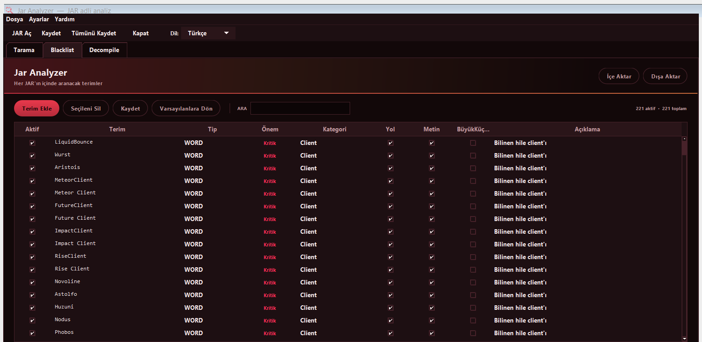
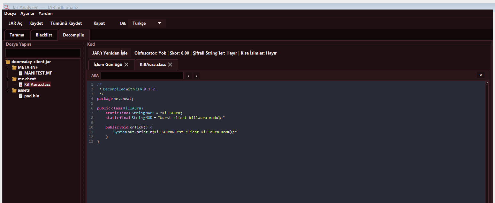

# Jar Analyzer

**Minecraft hile tespit aracı — screenshare için.**
Bilgisayardaki **her diskteki her JAR dosyasını** bulur, her sınıfın içini
blacklist ile tarar ve analize direnen arşivleri — obfuscate edilmiş, şifrelenmiş
veya uzantısı gizlenmiş — **şüpheli** olarak işaretler.

*Made by Winzys*

[**İndir (Releases)**](../../releases) · Kurulum yok · Java gerekmez



---

## İçindekiler

- [Neden var](#neden-var)
- [Ne yapar](#ne-yapar)
- [Nasıl çalışır](#nasıl-çalışır)
- [Sonuçlar ne demek](#sonuçlar-ne-demek)
- [Blacklist](#blacklist)
- [Decompile sekmesi](#decompile-sekmesi)
- [Rapor dışa aktarma](#rapor-dışa-aktarma)
- [Kurulum](#kurulum)
- [Komut satırı](#komut-satırı)
- [Neyi yapmaz](#neyi-yapmaz)
- [Kaynaktan derleme](#kaynaktan-derleme)
- [Lisans](#lisans)

---

## Neden var

Screenshare sırasında insanlar klasörlere tek tek bakar. Bu üç şeyi kaçırır:

- **Adı değiştirilmiş dosyalar.** `killaura.jar` → `d3d9.dll` yapıldığında göze
  DLL gibi görünür.
- **Silinmiş dosyalar.** Hile açılır, dosyası silinir, oyun çalışmaya devam eder.
- **Okunamayan arşivler.** Obfuscate edilmiş bir JAR'ı açıp bakmak dakikalar
  sürer ve çoğu kişi bakmaz.

Bu araç üçünü de kapatır ve bulduğu her şeyi **kanıtla birlikte** gösterir —
hangi terim, hangi sınıfın içinde, çevresinde ne yazıyordu.

---

## Ne yapar

### Tüm diskleri saniyeler içinde tarar

NTFS **Ana Dosya Tablosu'nu** (MFT) doğrudan okur. Klasörleri tek tek gezmek
yerine diskin dizinini birkaç sıralı okumayla alır — dolu bir diskte dakikalar
yerine saniyeler. Yönetici izni ister; alamazsa klasör gezmesine düşer, yavaşlar
ama hiçbir şeyi atlamaz.

### Sınıfların içine bakar

Her `.class` dosyasının **constant pool**'u okunur: sınıf isimleri, metot
isimleri, metin sabitleri. Blacklist üç yüzeyde birden çalışır:

| Yüzey | Ne taranır |
|---|---|
| **Dosya adı** | JAR'ın kendi adı |
| **Yol** | Arşiv içindeki girdi yolları ve sınıf isimleri |
| **Metin** | Constant pool sabitleri, `.json` / `.txt` / `.cfg` gibi metin kaynakları |

Tespit için decompile **gerekmez**. Bir blacklist teriminin eşleşebileceği her
isim ve metin zaten constant pool'da durur — kaynak koda dönüştürmek büyük bir
arşivde dakikalar sürer ve fazladan hiçbir şey bulmaz. Bu yüzden obfuscate
edilmiş, açılamayan bir JAR'da bile hile terimleri bulunur.

### Uzantıya kanmaz

Arşiv gibi adlandırılmamış her dosya **içeriğinden** kontrol edilir: önce 4 baytlık
`PK\x03\x04` imzası, sonra dosyanın sonundaki merkezi dizin kaydı. `d3d9.dll`,
`config.dat`, `readme.txt` — adı ne olursa olsun içinde JAR varsa bulunur.
Başına çöp bayt eklenmiş arşivler de yakalanır.

### Geri dönüşüm kutusunu tarar

Silinen dosyalar `$Recycle.Bin` içinde `$R…` adıyla bozulmadan durur. Silinmiş
olmak masumiyet değildir; genelde tam tersidir. Bu arşivler taranır ve
**"geri dönüşüm kutusunda"** notuyla işaretlenir.

### Çalışan oyunu tarar

Açık Java süreçlerine bağlanıp **gerçekte ne yüklediklerini** okur. Bir hile
açılıp dosyası silinse bile classpath girdisi çalışan süreçte durur — diskte
olmayan bir yol, aracın üretebileceği en güçlü sinyaldir.

Attach mekanizması kapatılmış (`-XX:+DisableAttachMechanism`) süreçler bile
Windows üzerinden komut satırı okunarak bulunur.

### JAR içindeki JAR'ları açar

İç içe arşivler iki seviye derinliğe kadar açılıp ayrı ayrı taranır; içeride
bulunan her şey dıştaki JAR'ın bulgularına *"(nested … içinde)"* etiketiyle
eklenir.

### Yapısal bulgular

Blacklist eşleşmesinin yanında arşivin kendisi de incelenir:

- **Obfuscation** — anlamsız/tek harfli sınıf isimleri, şifreli string'ler,
  bilinen obfuscator izleri (skor ve tahmin edilen obfuscator adıyla)
- **Şifreleme** — parola korumalı girdiler, WinZip AES işareti
- **Yüksek entropi** — okunamayan, şifreli olabilecek kaynak dosyaları
- **Java agent / coremod / TweakClass** — manifest'te `Premain-Class`,
  `Agent-Class`, `TweakClass`, `FMLCorePlugin`
- **Native kütüphane** — arşiv içinde `.dll` / `.so` / `.dylib`
- **Çalıştırılabilir betik** — `.bat`, `.ps1`, `.sh`, `.exe`
- **Bozuk yapı** — merkezi dizin uyuşmazlığı, çift girdi, dizin dışına çıkan
  yollar (`../`), tuhaf sıkıştırma yöntemleri, arşiv sonrası artık baytlar
- **Ayrıştırılamayan sınıflar** — constant pool yapısı basit ve sabittir; onu
  bozan bir sınıf kasıtlı olarak bozulmuştur

---

## Nasıl çalışır

```
1. KEŞİF     MFT taraması (veya klasör gezmesi)
             + uzantıya bakmadan içerik probu
             + geri dönüşüm kutusu
                      ↓
2. AÇMA      Ham ZIP incelemesi (yapı, şifreleme, artık baytlar)
                      ↓
3. OKUMA     Her sınıfın constant pool'u  ──→  blacklist (3 yüzey)
             Manifest, metin kaynakları, iç içe JAR'lar
                      ↓
4. KARAR     Bulgular + yapısal sinyaller  ──→  sonuç ve skor
```

Kaynak kod bu akışta hiç üretilmez. Kod okumak istediğinde **Decompile
sekmesi** devreye girer — bir arşiv için, sen istediğinde.

---

## Sonuçlar ne demek

| Sonuç | Anlamı |
|---|---|
| **TEMİZ** | Sorunsuz okundu, eşleşme yok |
| **DİKKAT** | Zayıf veya genel bir eşleşme var — tek başına bir şey ifade etmez |
| **ŞÜPHELİ** | Okunamadı: obfuscate, şifreli veya sınıfları ayrıştırılamıyor |
| **TESPİT** | Blacklist terimi kodun içinde bulundu |
| **KRİTİK** | Hem eşleşme var **hem de** arşiv analize direndi |
| **OKUNAMADI** | Arşiv hiç açılamadı — içeriği hakkında bir şey söylenemez |

**Skor** bulguların ağırlıklarından hesaplanır. Aynı terimin tekrarı ilk
görülmesinden çok daha az ekler, yani tek bir obfuscate JAR gerçekten kirli bir
JAR'ı geçemez.

> Bulgular **bir insanın değerlendirmesi için kanıttır**, kesin suç değildir.
> Blacklist yalnızca tek başına tuhaf olan terimleri içerir; değiştirilmemiş
> Minecraft, Fabric API ve JDK temiz kalır.

**"Okunamayan arşiv neden şüpheli?"** Çünkü okunamamak bir sonuçtur, eksik bir
sonuç değil. Obfuscation ve şifreleme tam olarak *okunmamak için* kullanılır.
Bu davranış sabittir ve kapatılamaz.

---

## Blacklist



**221 varsayılan terim**, kategorilere ayrılmış: bilinen hile client'ları,
combat modülleri (KillAura, Aimbot, TriggerBot…), hareket modülleri (Fly, Speed,
NoFall…), görsel modüller (X-Ray, ESP, Tracers…), otomasyon, dünya
manipülasyonu, anticheat atlatma, hile client mimarisi, kimlik hırsızlığı ve
bilinen hile paket isimleri.

Her terim düzenlenebilir:

- **Tip** — `WORD` (tam kelime), `LITERAL` (birebir metin), `REGEX`
- **Önem** — Kritik / Yüksek / Orta / Düşük / Bilgi
- **Yol / Metin** — hangi yüzeyde aransın
- **BüyükKüçük** — harf duyarlılığı
- **Aktif** — geçici olarak kapatma

Kendi terimlerini ekleyebilir, listeyi **dışa/içe aktarabilir** (JSON) ve
**Varsayılanlara Dön** ile fabrika listesine dönebilirsin. Liste
`%APPDATA%\JarAnalyzer\blacklist.json` içinde saklanır.

**Kurcalama uyarısı:** Varsayılan listedeki Kritik/Yüksek terimlerden biri
silinmişse arayüzde sarı bir şerit çıkar. Screenshare yapan biri listeyi sessizce
budayıp bilinen bir hileyi geçiremesin diye.

---

## Decompile sekmesi



Bir JAR'ı açtığında dört adım çalışır:

1. **Şifre çözme** — şifreli sınıf verisi varsa çözülür
2. **Deobfuscation** — *yalnızca obfuscation tespit edilirse*. String'ler
   çözülür, anlamsız isimler yeniden adlandırılır, düzleştirilmiş control-flow
   açılır, reflection çağrıları çözümlenir
3. **Hile taraması** — sınıflar hile terimleri için taranır, eşleşmeler kodun
   içinde kırmızı ile işaretlenir
4. **Yükleme** — sonuç sol taraftaki ağaçta açılır

`Ctrl+F` ile arama yapılır. Tarama sekmesinde bir satıra **çift tıklamak** o
JAR'ı doğrudan burada açar.

Bunlar **kodu senin okuyabilmen için** çalışır; tarama sonucunu etkilemezler.
Deobfuscation basit ve orta seviye obfuscation'ı çözer; ticari veya özel yazılmış
obfuscator'ları tam açamaz. O durumda kod okunmaz kalır ama JAR yine **ŞÜPHELİ**
olarak raporlanır — tespit zaten constant pool üzerinden yapılıyor.

---

## Rapor dışa aktarma

**Rapor Dışa Aktar** üç dosya üretir:

| Dosya | İçerik |
|---|---|
| `report.txt` | Okunabilir tam rapor — her arşiv, her bulgu, kanıt satırlarıyla |
| `report.json` | Makine tarafından işlenebilir; skorlar, hash'ler, bulgu listesi |
| `report.html` | Tarayıcıda açılan, paylaşılabilir biçim |

Her arşiv için **SHA-256** hesaplanır ve rapora yazılır.

---

## Kurulum

[**Releases**](../../releases) bölümünden `JarAnalyzer.exe` dosyasını indir ve
çift tıkla. Kurulum penceresi yok, Java kurulu olmasına gerek yok — Java çalışma
ortamı exe'nin içinde geliyor.

Hızlı disk taraması (MFT) için **yönetici izni** ister. Vermezsen program yine
çalışır, tarama daha yavaş olur.

İlk çalıştırmada kendini `%LOCALAPPDATA%\JarAnalyzer\` altına açar; sonraki
açılışlar anında olur.

**Doğrulama —** `JarAnalyzer.exe` SHA-256:

```
3219f59561bde4ddbbd509a19a1e01dd68f92053319122e35ab662c4d15ec208
```

Yardım → Hakkında, çalışan kopyanın kendi hash'ini gösterir; bu ikisi
eşleşiyorsa indirdiğin dosya yayınlanan derlemedir.

---

## Komut satırı

Arayüz açmadan tarama yapıp rapor üretir:

```powershell
java -jar JarAnalyzer.jar --scan-all rapor-klasoru
java -jar JarAnalyzer.jar --scan "<klasör-veya-jar>" rapor-klasoru
```

Çıktı, sonuçları satır satır yazar ve sonunda bir özet tablosu verir; üç rapor
dosyası belirttiğin klasöre yazılır.

---

## Neyi yapmaz

Dürüst olmak gerekirse:

- **Ayar yoktur.** Hiçbir şey kapatılamaz, hiçbir klasör hariç tutulamaz,
  hiçbir kütüphane atlanmaz. Herkes aynı davranışı kullanır, böylece bir sonuç
  kimde üretildiğine bakmadan aynı şeyi ifade eder.
- **Çalışma anında birleştirilen metinleri göremez.** `"Kill" + degisken`
  şeklinde çalışma anında oluşturulan bir isim statik taramada görünmez.
  Obfuscation heuristic'i ve çalışan JVM taraması bu boşluğu kısmen kapatır.
- **Kesin karar vermez.** Araç kanıt gösterir; kararı sen verirsin.
- **Yalnızca Windows.** MFT taraması ve süreç okuma Windows'a özgüdür.

---

## Kaynaktan derleme

JDK 17+ gerekir. Maven veya Gradle yok — düz `javac` ve `jar`.

```powershell
.\build.ps1              # derle -> build\JarAnalyzer.jar
.\build.ps1 -Run         # derle ve çalıştır
.\build.ps1 -Clean       # build\ klasörünü sıfırla
.\build.ps1 -Package     # uygulama klasörü -> dist\Jar Analyzer\
.\build.ps1 -SingleFile  # tek dosya exe -> dist\JarAnalyzer.exe
```

`-SingleFile`, `-Package` çıktısını tek bir exe'ye sarar. Yayınlanan dosya budur,
yani `Releases`'teki exe elle değil bu komutla üretilir.

Kullanılan kütüphaneler: **CFR** (decompiler), **ASM** (bytecode), **Gson**
(JSON), **JNA** (Windows API). Ayrıntılar: [`THIRD-PARTY.md`](THIRD-PARTY.md).

---

## Lisans

Kaynak kod **inceleme amaçlıdır**: okuyabilirsin, ama izinsiz kopyalayamaz,
değiştiremez veya kendi projende kullanamazsın. Derlenmiş uygulama serbestçe
indirilip çalıştırılabilir. Bkz. [`LICENSE`](LICENSE).

---
---

# English

**Minecraft cheat-detection tool, built for screenshares.**
Finds **every JAR on every drive**, runs a blacklist through the inside of every
class, and flags archives that resist analysis — obfuscated, encrypted, or
disguised — as **suspicious**.

*Made by Winzys*

[**Download (Releases)**](../../releases) · No installer · No Java needed

---

## Why it exists

During a screenshare people click through folders by hand. That misses three
things:

- **Renamed files.** `killaura.jar` → `d3d9.dll` looks like a DLL.
- **Deleted files.** The cheat is launched, its file removed, the game keeps
  running.
- **Unreadable archives.** Opening an obfuscated JAR takes minutes, so most
  people don't.

This closes all three, and shows **the evidence** for everything it finds —
which term, inside which class, and the text around it.

---

## What it does

### Sweeps every drive in seconds

Reads the NTFS **Master File Table** directly. Instead of walking directories it
takes the volume index in a few sequential passes — seconds instead of minutes on
a full disk. It asks for administrator rights; without them it falls back to a
directory walk, which is slower but skips nothing.

### Looks inside classes

Every `.class` file's **constant pool** is read: class names, method names,
string literals. The blacklist runs across three surfaces:

| Surface | What is scanned |
|---|---|
| **File name** | The JAR's own name |
| **Path** | Entry paths and class names inside the archive |
| **String** | Constant-pool literals and text resources (`.json`, `.txt`, `.cfg`…) |

Detection needs **no decompilation**. Every name and literal a blacklist term
could match is already in the constant pool — rebuilding Java out of it costs
minutes per large archive and finds nothing more. That is why cheat terms are
still found in an obfuscated JAR that cannot be opened.

### Ignores the extension

Any file not named like an archive is checked **by content**: first the four-byte
`PK\x03\x04` signature, then the end-of-central-directory record at the tail.
`d3d9.dll`, `config.dat`, `readme.txt` — whatever it is called, a JAR inside is
found. Archives with junk bytes prepended are caught too.

### Scans the recycle bin

Deleted files sit intact in `$Recycle.Bin` under a `$R…` name. Being deleted is
not innocence — it is usually the opposite. Those archives are scanned and marked
**"in the recycle bin"**.

### Scans the running game

Attaches to live Java processes and reads **what they actually loaded**. A cheat
can be launched and its file deleted; the classpath entry survives in the running
process, so a path that no longer exists on disk is the loudest signal this tool
can produce.

Processes started with `-XX:+DisableAttachMechanism` are still found by reading
their command line through Windows.

### Opens JARs inside JARs

Nested archives are opened two levels deep and scanned separately; anything found
inside is added to the outer JAR's findings tagged *"(in nested …)"*.

### Structural findings

Beyond blacklist matches, the archive itself is examined:

- **Obfuscation** — meaningless or single-letter class names, encrypted strings,
  known obfuscator markers (with a score and a guess at which one)
- **Encryption** — password-protected entries, the WinZip AES marker
- **High entropy** — unreadable resources that may be encrypted payloads
- **Java agent / coremod / TweakClass** — `Premain-Class`, `Agent-Class`,
  `TweakClass`, `FMLCorePlugin` in the manifest
- **Native libraries** — `.dll` / `.so` / `.dylib` inside the archive
- **Executable scripts** — `.bat`, `.ps1`, `.sh`, `.exe`
- **Broken structure** — central-directory mismatches, duplicate entries, paths
  escaping the archive (`../`), exotic compression methods, trailing bytes
- **Unparseable classes** — the constant-pool format is simple and fixed; a class
  that breaks it was broken on purpose

---

## Verdicts

| Verdict | Meaning |
|---|---|
| **CLEAN** | Read fine, no matches |
| **NOTABLE** | A weak or generic match — nothing on its own |
| **SUSPICIOUS** | Unreadable: obfuscated, encrypted, or classes will not parse |
| **DETECTED** | A blacklist term was found in the code |
| **CRITICAL** | Both a match **and** an archive that resisted analysis |
| **UNREADABLE** | The archive would not open at all — nothing can be said about it |

The **score** comes from finding weights. Repeats of the same term add far less
than the first sighting, so one obfuscated jar cannot out-score a genuinely dirty
one.

> Findings are **evidence for a person to weigh**, not proof of guilt. The
> blacklist holds only terms that are strange on their own, so unmodified
> Minecraft, Fabric API and the JDK stay clean.

**"Why is an unreadable archive suspicious?"** Because being unreadable is a
result, not a missing one. Obfuscation and encryption exist precisely to avoid
being read. This behaviour is fixed and cannot be turned off.

---

## Blacklist

**221 built-in terms** by category: known cheat clients, combat modules
(KillAura, Aimbot, TriggerBot…), movement (Fly, Speed, NoFall…), visuals (X-Ray,
ESP, Tracers…), automation, world manipulation, anticheat bypass, cheat-client
architecture, credential theft, and known cheat package names.

Every term is editable — match type (`WORD` / `LITERAL` / `REGEX`), severity,
which surfaces it applies to, case sensitivity, and an on/off switch. You can add
your own, **import/export** the list as JSON, and **Restore Defaults** at any
time. It lives in `%APPDATA%\JarAnalyzer\blacklist.json`.

**Tamper warning:** if any built-in CRITICAL/HIGH term has been removed, a yellow
bar appears in the UI — so nobody can quietly gut the list to sneak a known cheat
past a screenshare.

---

## The Decompile tab

Opening a JAR runs four steps:

1. **Decryption** — encrypted class data is decrypted if present
2. **Deobfuscation** — *only when obfuscation is detected*. Strings are
   decrypted, mangled names remapped, flattened control flow unwound, reflection
   calls resolved
3. **Cheat scan** — classes are scanned for cheat terms and matches highlighted
   in red
4. **Load** — the result opens in the tree on the left

`Ctrl+F` to search. **Double-clicking** a row on the Scan tab opens that JAR
here directly.

These run so *you* can read the code; they do not affect the verdict.
Deobfuscation handles simple and mid-level obfuscation — commercial or custom
obfuscators are not fully undone. The code then stays unreadable, but the JAR is
still reported **SUSPICIOUS**, because detection already ran off the constant
pool.

---

## Report export

**Export Report** writes three files: `report.txt` (full readable report with
evidence lines), `report.json` (machine-readable — scores, hashes, findings), and
`report.html` (shareable, opens in a browser). A **SHA-256** is computed for
every archive and recorded.

---

## Install

Download `JarAnalyzer.exe` from [**Releases**](../../releases) and double-click
it. No installer window, no Java required — the runtime ships inside the exe.

It requests **administrator rights** for the fast MFT disk sweep. Decline and it
still runs, just slower. On first launch it unpacks itself into
`%LOCALAPPDATA%\JarAnalyzer\`; later launches are instant.

**Verify —** `JarAnalyzer.exe` SHA-256:

```
3219f59561bde4ddbbd509a19a1e01dd68f92053319122e35ab662c4d15ec208
```

Help → About shows the running copy's own hash; if the two match, what you
downloaded is the published build.

---

## Command line

```powershell
java -jar JarAnalyzer.jar --scan-all report-dir
java -jar JarAnalyzer.jar --scan "<folder-or-jar>" report-dir
```

Prints results as they come in, ends with a summary table, and writes the three
report files to the directory you name.

---

## What it does not do

- **There are no settings.** Nothing can be turned off, no folder excluded, no
  library skipped. Everyone runs the same behaviour, so a result means the same
  thing regardless of who produced it.
- **It cannot see strings built at runtime.** A name assembled as
  `"Kill" + variable` does not exist in the file. The obfuscation heuristic and
  the running-JVM scan partly cover that gap.
- **It does not decide.** The tool shows evidence; the judgement is yours.
- **Windows only.** The MFT sweep and process inspection are Windows-specific.

---

## Build from source

Requires JDK 17+. No Maven, no Gradle — plain `javac` and `jar`.

```powershell
.\build.ps1              # compile -> build\JarAnalyzer.jar
.\build.ps1 -Run         # compile and launch
.\build.ps1 -Clean       # wipe build\
.\build.ps1 -Package     # application folder -> dist\Jar Analyzer\
.\build.ps1 -SingleFile  # one-file exe -> dist\JarAnalyzer.exe
```

`-SingleFile` wraps the `-Package` output into a single exe. That is what gets
published, so the release asset is produced by this command rather than by hand.

Libraries used: **CFR** (decompiler), **ASM** (bytecode), **Gson** (JSON),
**JNA** (Windows API). See [`THIRD-PARTY.md`](THIRD-PARTY.md).

---

## License

The source is published **for inspection only** — you may read it, but not copy,
modify or reuse it without permission. The compiled application may be freely
downloaded and run. See [`LICENSE`](LICENSE).
